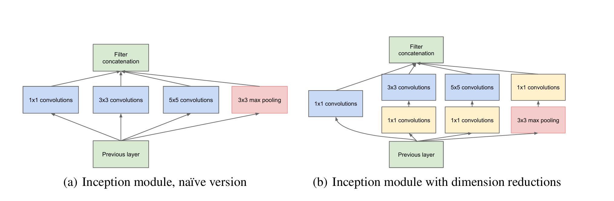

# inception

## 核心思想

对输入图像并行地执行多个卷积运算或池化操作，并将所有输出结果拼接为一个非常深的特征图。因为 1*1、3*3 或 5*5 等不同的卷积运算与池化操作可以获得输入图像的不同信息，并行处理这些运算并结合所有结果将获得更好的图像表征。

Inception常见的版本有：

* Inception v1
* Inception v2 和 Inception v3
* Inception v4 和 Inception-ResNet

每个版本都是前一个版本的迭代进化。了解 Inception 网络的升级可以帮助我们构建自定义分类器，优化速度和准确率。

## Inception V1 

首先是出现在[《Going deeper with convolutions》](https://ieeexplore.ieee.org/document/7298594)这篇论文中，作者提出一种深度卷积神经网络 Inception，它在 ILSVRC14 中达到了当时最好的分类和检测性能。

