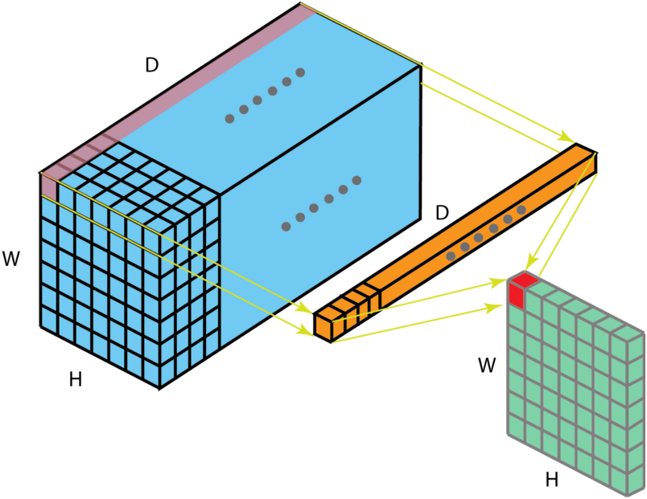
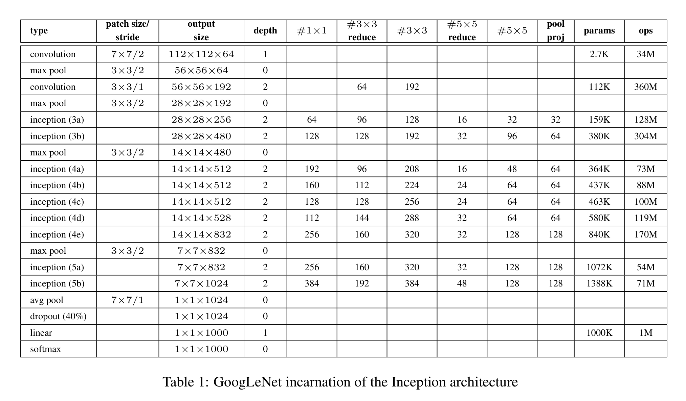
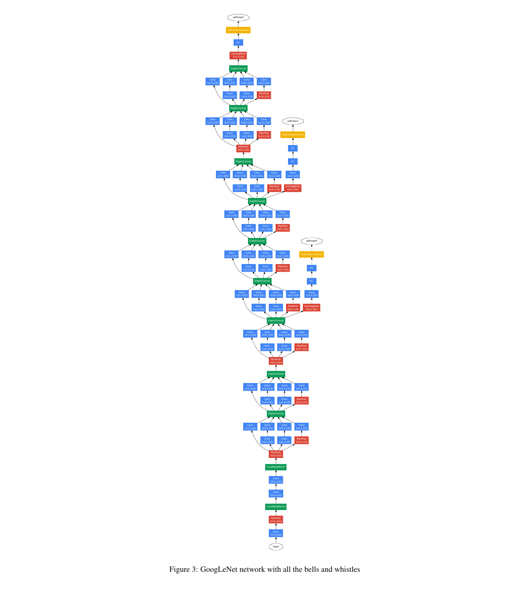

# inception

## 核心思想

对输入图像并行地执行多个卷积运算或池化操作，并将所有输出结果拼接为一个非常深的特征图。因为 1*1、3*3 或 5*5 等不同的卷积运算与池化操作可以获得输入图像的不同信息，并行处理这些运算并结合所有结果将获得更好的图像表征。

Inception常见的版本有：

* Inception v1
* Inception v2 和 Inception v3
* Inception v4 和 Inception-ResNet

每个版本都是前一个版本的迭代进化。了解 Inception 网络的升级可以帮助我们构建自定义分类器，优化速度和准确率。

## Inception V1 

首先是出现在[《Going deeper with convolutions》](https://ieeexplore.ieee.org/document/7298594)这篇论文中，作者提出一种深度卷积神经网络 Inception，它在 ILSVRC14 中达到了当时最好的分类和检测性能。
1*1卷积核计算方法如下图。

如上图$a$所示，基本的 Inception 模块，其通过不同尺度的卷积核并联，来提取更密集的特征。也可以用其他尺寸的卷积核，但是这几种更方便。

假设输入的数据的shape为(batchsize=8,channels=128,H=256,W=256),inception中卷积核分别为64，128，32，
$1*1$卷积层输出尺寸为(8,64,256,256),
$3*3$卷积层,padding为1，stride为1，输出尺寸为(8,128,256，256)
$5*5$卷积层，padding为2,stride为1，输出尺寸为(8,32,256，256)
$3*3$最大池化层，输出尺寸为(8,128,256，256)
在所有卷积核运算结束之后，通过 concatenate 运算（在 depth 维度上进行），将结果进行组合,形成一个(8,352,256,256)尺寸的输出，代表提取的特征集合。

不同尺寸的卷积核，可以提取不同尺度的特征，代表不同的相关特征，并同时引入了多尺度。由于网络的层数越深，需要提取的特征越抽象，因此，相应的$3*3$和$5*5$卷积核数量要相应的增多。在所有卷积核运算结束之后，通过 concatenate 运算（在 depth 维度上进行），将结果进行组合。整个 GoogLeNet 网络通过大量 Inception 模块堆叠而成。

上图$b$为改进的inception结构，在原本的 Inception 模块中，存在卷积运算运算量过大的问题。当上一层的输出通道数较大时，当前 Inception 模块的运算量将很大，且由于多组卷积核并联运算，因此这是随着层数的堆叠而爆炸式增长的！

针对这一问题，使用$1*1$卷积作为 $reduction$ 层，来缩减通道数，从而减少计算量。具体做法为：在每一个$3*3$和$5*5$的卷积层之前，加上$1*1$的卷积层。其在减少计算量的同时，还引入了非线性，进一步增加了网络的表达能力。

同样假设输入的数据的shape为(batchsize=8,channels=3,H=256,W=256),inception中卷积核分别为64，（96，128），（16，32），最大池化层对应的$1*1$卷积核为32
$1*1$卷积层输出尺寸为(8,64,256,256),
$3*3$卷积层,padding为1，stride为1，输出尺寸为(8,128,256，256)
$5*5$卷积层，padding为2,stride为1，输出尺寸为(8,32,256，256)
$3*3$最大池化层后$1*1$卷积，输出尺寸为(8,32,256，256)
在所有卷积核运算结束之后，通过 concatenate 运算（在 depth 维度上进行），将结果进行组合。形成一个(8,256,256,256)尺寸的输出。

从上述可以看出，改进后的Inception结构，在不断叠加inception的情况下，能够保证通道数不会爆炸，一直保持在一个确定的数量上，更适合进行网络层数的叠加。

[下图是论文作者在进行图像识别是搭建的一个基于该结构的网络。](./image/inceptionV1.pdf)

